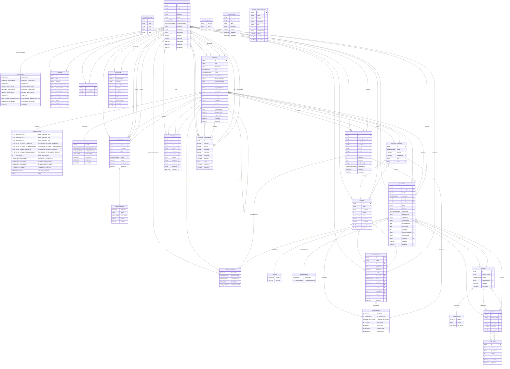

```mermaid
erDiagram

        SecurityClassification {
            PUBLICO PUBLICO
RESTRINGIDO RESTRINGIDO
CONFIDENCIAL CONFIDENCIAL
SECRETO SECRETO
ALTO_SECRETO ALTO_SECRETO
        }
    


        DiplomaticRole {
            EMBAJADOR EMBAJADOR
MINISTRO_CONSEJERO MINISTRO_CONSEJERO
CONSEJERO CONSEJERO
PRIMER_SECRETARIO PRIMER_SECRETARIO
SEGUNDO_SECRETARIO SEGUNDO_SECRETARIO
TERCER_SECRETARIO TERCER_SECRETARIO
AGREGADO AGREGADO
FUNCIONARIO_ADMINISTRATIVO FUNCIONARIO_ADMINISTRATIVO
CONSULTOR_EXTERNO CONSULTOR_EXTERNO
INVITADO INVITADO
        }
    


        DocumentType {
            HOJA_REMISION_OGA HOJA_REMISION_OGA
HOJA_REMISION_PCO HOJA_REMISION_PCO
HOJA_REMISION_PRU HOJA_REMISION_PRU
GUIA_VALIJA_ENTRADA_ORDINARIA GUIA_VALIJA_ENTRADA_ORDINARIA
GUIA_VALIJA_ENTRADA_EXTRAORDINARIA GUIA_VALIJA_ENTRADA_EXTRAORDINARIA
GUIA_VALIJA_SALIDA_ORDINARIA GUIA_VALIJA_SALIDA_ORDINARIA
GUIA_VALIJA_SALIDA_EXTRAORDINARIA GUIA_VALIJA_SALIDA_EXTRAORDINARIA
NOTA_DIPLOMATICA NOTA_DIPLOMATICA
DESPACHO_TELEGRAFICO DESPACHO_TELEGRAFICO
MEMORANDUM_INTERNO MEMORANDUM_INTERNO
MEMORANDUM_EXTERNO MEMORANDUM_EXTERNO
COMUNICADO_PRENSA COMUNICADO_PRENSA
INFORME_TECNICO INFORME_TECNICO
OTRO OTRO
        }
    


        DocumentStatus {
            DRAFT DRAFT
PENDING_REVIEW PENDING_REVIEW
UNDER_REVIEW UNDER_REVIEW
APPROVED APPROVED
REJECTED REJECTED
ARCHIVED ARCHIVED
DELETED DELETED
        }
    


        WorkflowStatus {
            CREATED CREATED
IN_PROGRESS IN_PROGRESS
PENDING_APPROVAL PENDING_APPROVAL
APPROVED APPROVED
REJECTED REJECTED
COMPLETED COMPLETED
CANCELLED CANCELLED
        }
    


        NotificationStatus {
            PENDING PENDING
SENT SENT
DELIVERED DELIVERED
READ READ
FAILED FAILED
        }
    


        UnidadRemitente {
            OGA OGA
PCO PCO
PRU PRU
CON CON
ADM ADM
        }
    


        TipoGuia {
            ENTRADA ENTRADA
SALIDA SALIDA
        }
    


        ModalidadValija {
            ORDINARIA ORDINARIA
EXTRAORDINARIA EXTRAORDINARIA
        }
    


        EstadoPrecinto {
            INTACTO INTACTO
ROTO ROTO
FALTANTE FALTANTE
        }
    
  "users" {
    String id "🗝️"
    String email 
    String name 
    String password "❓"
    String avatar "❓"
    DiplomaticRole diplomaticRole 
    SecurityClassification securityClearance 
    String embassy "❓"
    String department "❓"
    String employeeId "❓"
    Boolean isActive 
    Boolean isVerified 
    DateTime lastLoginAt "❓"
    DateTime createdAt 
    DateTime updatedAt 
    }
  

  "accounts" {
    String id "🗝️"
    String type 
    String provider 
    String providerAccountId 
    String refresh_token "❓"
    String access_token "❓"
    Int expires_at "❓"
    String token_type "❓"
    String scope "❓"
    String id_token "❓"
    String session_state "❓"
    }
  

  "sessions" {
    String id "🗝️"
    String sessionToken 
    DateTime expires 
    }
  

  "verification_tokens" {
    String identifier 
    String token 
    DateTime expires 
    }
  

  "documents" {
    String id "🗝️"
    String title 
    String description "❓"
    DocumentType type 
    DocumentStatus status 
    SecurityClassification classification 
    String documentNumber "❓"
    String referenceNumber "❓"
    Int version 
    String originalFileName "❓"
    String storagePath "❓"
    Int fileSize "❓"
    String mimeType "❓"
    String checksum "❓"
    String ocrText "❓"
    Float ocrConfidence "❓"
    Json extractedData "❓"
    DateTime documentDate "❓"
    DateTime expirationDate "❓"
    DateTime createdAt 
    DateTime updatedAt 
    }
  

  "workflows" {
    String id "🗝️"
    String name 
    String description "❓"
    Int version 
    WorkflowStatus status 
    Boolean isActive 
    Boolean isTemplate 
    DateTime createdAt 
    DateTime updatedAt 
    }
  

  "workflow_steps" {
    String id "🗝️"
    String name 
    String description "❓"
    Int stepOrder 
    Boolean isRequired 
    Boolean autoExecute 
    Int timeoutHours "❓"
    WorkflowStatus status 
    DateTime startedAt "❓"
    DateTime completedAt "❓"
    Json inputData "❓"
    Json outputData "❓"
    String notes "❓"
    DateTime createdAt 
    DateTime updatedAt 
    }
  

  "document_workflows" {
    String id "🗝️"
    WorkflowStatus status 
    DateTime startedAt 
    DateTime completedAt "❓"
    Json data "❓"
    String notes "❓"
    }
  

  "notifications" {
    String id "🗝️"
    String title 
    String message 
    String type 
    Int priority 
    NotificationStatus status 
    DateTime readAt "❓"
    DateTime createdAt 
    DateTime updatedAt 
    }
  

  "audit_logs" {
    String id "🗝️"
    String action 
    String entity 
    String entityId 
    Json oldValues "❓"
    Json newValues "❓"
    Json changes "❓"
    String ipAddress "❓"
    String userAgent "❓"
    String sessionId "❓"
    DateTime createdAt 
    }
  

  "system_config" {
    String id "🗝️"
    String key 
    String value 
    String description "❓"
    Boolean isPublic 
    DateTime createdAt 
    DateTime updatedAt 
    }
  

  "file_uploads" {
    String id "🗝️"
    String originalName 
    String fileName 
    String storagePath 
    Int fileSize 
    String mimeType 
    String checksum 
    Boolean isProcessed 
    String processingError "❓"
    DateTime createdAt 
    DateTime updatedAt 
    }
  

  "hojas_remision" {
    String id "🗝️"
    String numeroDocumento 
    String unidadRemitente 
    DateTime fechaEmision 
    String asunto "❓"
    String destino 
    String observaciones "❓"
    Int cantidad "❓"
    Float pesoItem "❓"
    String tipoEmbalaje "❓"
    SecurityClassification clasificacion 
    DateTime createdAt 
    DateTime updatedAt 
    }
  

  "guias_valija" {
    String id "🗝️"
    String numeroGuia "❓"
    TipoGuia tipoGuia 
    ModalidadValija modalidad 
    DateTime fechaDespacho "❓"
    DateTime fechaRecepcion "❓"
    String origen 
    String destino 
    SecurityClassification clasificacion 
    String preparadoPor "❓"
    String revisadoPor "❓"
    String receptorFirma "❓"
    Float pesoTotalItems "❓"
    Float pesoOficial "❓"
    Int totalItems "❓"
    String numeroGuiaAerea "❓"
    String numeroBolsa "❓"
    String tipoBolsa "❓"
    DateTime createdAt 
    DateTime updatedAt 
    }
  

  "valijas_internas" {
    String id "🗝️"
    String numeroValija 
    Int orden 
    String descripcion "❓"
    DateTime createdAt 
    DateTime updatedAt 
    }
  

  "items_valija" {
    String id "🗝️"
    Int orden 
    String descripcion 
    Int cantidad 
    String observaciones "❓"
    DateTime createdAt 
    DateTime updatedAt 
    }
  

  "precintos" {
    String id "🗝️"
    String numeroPrecinto 
    EstadoPrecinto estado 
    String observaciones "❓"
    DateTime createdAt 
    DateTime updatedAt 
    }
  

  "document_authorizations" {
    String id "🗝️"
    Boolean canRead 
    Boolean canEdit 
    Boolean canDelete 
    Boolean canShare 
    DateTime validFrom 
    DateTime validUntil "❓"
    String reason "❓"
    DateTime createdAt 
    DateTime updatedAt 
    }
  

  "unidades_organizacionales" {
    String id "🗝️"
    String sigla 
    String nombre 
    String descripcion "❓"
    String tipo "❓"
    Int jerarquia "❓"
    String unidadPadre "❓"
    Boolean isActive 
    DateTime createdAt 
    DateTime updatedAt 
    }
  
    "users" o|--|| "DiplomaticRole" : "enum:diplomaticRole"
    "users" o|--|| "SecurityClassification" : "enum:securityClearance"
    "users" o{--}o "accounts" : ""
    "users" o{--}o "sessions" : ""
    "users" o{--}o "documents" : ""
    "users" o{--}o "documents" : ""
    "users" o{--}o "workflows" : ""
    "users" o{--}o "workflow_steps" : ""
    "users" o{--}o "notifications" : ""
    "users" o{--}o "notifications" : ""
    "users" o{--}o "audit_logs" : ""
    "users" o{--}o "hojas_remision" : ""
    "users" o{--}o "guias_valija" : ""
    "users" o{--}o "document_authorizations" : ""
    "users" o{--}o "document_authorizations" : ""
    "users" o{--}o "file_uploads" : ""
    "accounts" o|--|| "users" : "user"
    "sessions" o|--|| "users" : "user"
    "documents" o|--|| "DocumentType" : "enum:type"
    "documents" o|--|| "DocumentStatus" : "enum:status"
    "documents" o|--|| "SecurityClassification" : "enum:classification"
    "documents" o|--|| "users" : "creator"
    "documents" o|--|o "users" : "assignedTo"
    "documents" o{--}o "document_workflows" : ""
    "documents" o|--|o "documents" : "parentDocument"
    "documents" o{--}o "notifications" : ""
    "documents" o{--}o "audit_logs" : ""
    "documents" o{--}o "hojas_remision" : ""
    "documents" o{--}o "guias_valija" : ""
    "documents" o{--}o "document_authorizations" : ""
    "workflows" o|--|| "WorkflowStatus" : "enum:status"
    "workflows" o|--|| "users" : "creator"
    "workflows" o{--}o "workflow_steps" : ""
    "workflows" o{--}o "document_workflows" : ""
    "workflow_steps" o|--|| "WorkflowStatus" : "enum:status"
    "workflow_steps" o|--|| "workflows" : "workflow"
    "workflow_steps" o|--|o "users" : "assignedTo"
    "document_workflows" o|--|| "WorkflowStatus" : "enum:status"
    "document_workflows" o|--|| "documents" : "document"
    "document_workflows" o|--|| "workflows" : "workflow"
    "notifications" o|--|| "NotificationStatus" : "enum:status"
    "notifications" o|--|o "users" : "sender"
    "notifications" o|--|| "users" : "receiver"
    "notifications" o|--|o "documents" : "document"
    "audit_logs" o|--|o "users" : "user"
    "audit_logs" o|--|o "documents" : "document"
    "file_uploads" o|--|o "users" : "uploadedBy"
    "hojas_remision" o|--|| "SecurityClassification" : "enum:clasificacion"
    "hojas_remision" o|--|o "guias_valija" : "guiaValija"
    "hojas_remision" o|--|| "documents" : "document"
    "hojas_remision" o|--|| "users" : "createdBy"
    "guias_valija" o|--|| "TipoGuia" : "enum:tipoGuia"
    "guias_valija" o|--|| "ModalidadValija" : "enum:modalidad"
    "guias_valija" o|--|| "SecurityClassification" : "enum:clasificacion"
    "guias_valija" o|--|| "documents" : "document"
    "guias_valija" o|--|| "users" : "createdBy"
    "guias_valija" o{--}o "precintos" : ""
    "guias_valija" o{--}o "valijas_internas" : ""
    "valijas_internas" o|--|| "guias_valija" : "guiaValija"
    "valijas_internas" o{--}o "items_valija" : ""
    "valijas_internas" o{--}o "precintos" : ""
    "items_valija" o|--|| "valijas_internas" : "valijaInterna"
    "precintos" o|--|| "EstadoPrecinto" : "enum:estado"
    "precintos" o|--|o "guias_valija" : "guiaValija"
    "precintos" o|--|o "valijas_internas" : "valijaInterna"
    "document_authorizations" o|--|| "documents" : "document"
    "document_authorizations" o|--|| "users" : "user"
    "document_authorizations" o|--|| "users" : "authorizedBy"
```
